# Chief-Staff Workflows — Comprehensive Mermaid Diagram

Complete visual reference for all four production workflows in the `workflows/` folder. Every step is shown with its concrete service binding, the LLM model used, and the data handoff between steps.

## Color / Shape Legend

| Color | Meaning | Examples |
|---|---|---|
| Yellow (gold) | Trigger / Event source | Calendly webhook, Cron scheduler, File watcher |
| Purple | LLM Gateway call (OpenRouter) | Summarization, extraction, generation, TTS |
| Green | Data store / file system | Google Sheets, Google Drive, Google Docs, Google Tasks, Trello |
| Red-orange | Human-in-the-loop gate | Slack DM, Email form, Triage prompts |
| Orange diamond | Decision / branch router | Path A vs Path B |
| Pink | Delivery channel (email/chat) | Gmail, Slack DM, Gmail Drafts |
| Blue | Process / aggregation node | Loops, flatteners, time delays, move ops |
| Beige | External service (RSS / HTTP fetch) | RSS feed parser |

---

## Master Workflow Diagram

```mermaid
graph TB
    %% ===================================================================
    %% CHIEF-STAFF WORKFLOWS - COMPREHENSIVE VISUAL DIAGRAM
    %% Source: workflows/ folder (4 production workflows)
    %% ===================================================================

    classDef triggerStyle fill:#FFD700,stroke:#B8860B,stroke-width:3px,color:#000
    classDef llmStyle fill:#DDA0DD,stroke:#8B008B,stroke-width:2px,color:#000
    classDef dataStyle fill:#98FB98,stroke:#228B22,stroke-width:1px,color:#000
    classDef hitlStyle fill:#FF6347,stroke:#8B0000,stroke-width:2px,color:#FFF
    classDef decisionStyle fill:#FFA500,stroke:#FF8C00,stroke-width:3px,color:#000
    classDef deliveryStyle fill:#FFB6C1,stroke:#8B0000,stroke-width:1px,color:#000
    classDef processStyle fill:#87CEEB,stroke:#4682B4,stroke-width:1px,color:#000
    classDef externalStyle fill:#F5F5DC,stroke:#666,stroke-width:1px,color:#000

    %% ===================================================================
    %% WORKFLOW 1: BRIEFING PREPARATION ASSISTANT (19 STEPS)
    %% Trigger: Calendly 'Event Scheduled'
    %% ===================================================================
    subgraph WF1["<b>WF1: Briefing Preparation Assistant</b><br/>19 Steps | Trigger: Calendly Event Scheduled | Owner: Relay.app"]
        direction TB

        W1S1["1. Calendly Webhook<br/>Event type: 'Event scheduled'<br/>Payload: event metadata<br/>(name, start, invitee, organizer)"]:::triggerStyle
        W1S2["2. Email Confirmation<br/>Service: Gmail SMTP<br/>To: invitee | CC: guests<br/>Subject: '{Event} - Confirmation'"]:::deliveryStyle
        W1S3["3. Org Context Lookup<br/>Service: Google Sheets<br/>Query: rows matching event<br/>Returns: Target Company Name"]:::dataStyle
        W1S4["4. HITL Triage<br/>Channel: Slack DM<br/>Question: 'Additional Input?'<br/>Type: Boolean | Reminder: 1d"]:::hitlStyle
        W1S5{"5. Conditional Router<br/>triageResponse.Additional Input?<br/>Yes → Path A | No → Path B"}:::decisionStyle

        subgraph WF1A["<b>PATH A: Supplemental Context (Yes)</b>"]
            W1S6["6. Multi-Field Intake Form<br/>Channel: Gmail inbound<br/>Fields: Free Text, Files, URLs<br/>Reminder: 1 day"]:::hitlStyle
            W1S7["7. Directory Lookup<br/>Service: Google Drive<br/>Parent: 'Consultant X' folder<br/>Filter: name CONTAINS company"]:::dataStyle
            W1S8["8. File Retrieval<br/>Service: Google Drive<br/>Filter: title contains<br/>'{Invitee}' + 'SaaS Performance<br/>Assessment'"]:::dataStyle
            W1S9["9. LLM: Document Summary<br/>Service: OpenRouter<br/>Model: openai/gpt-4.1<br/>Output: paragraphs of text"]:::llmStyle
            W1S10["10. LLM: Generate Briefing<br/>Service: OpenRouter<br/>Model: openai/gpt-4.1<br/>Schema: 5 sections<br/>(Items, Structure, Exception<br/>Handling, Stakeholders, Risk)"]:::llmStyle
        end

        subgraph WF1B["<b>PATH B: No Supplemental (No)</b>"]
            W1S11["11. Directory Lookup<br/>Service: Google Drive<br/>Same pattern as Step 7"]:::dataStyle
            W1S12["12. File Retrieval<br/>Service: Google Drive<br/>Same pattern as Step 8"]:::dataStyle
            W1S13["13. LLM: Document Summary<br/>Service: OpenRouter<br/>Model: openai/gpt-4.1<br/>No supplemental context"]:::llmStyle
            W1S14["14. LLM: Generate Briefing<br/>Service: OpenRouter<br/>Model: openai/gpt-4.1<br/>Schema: 5 sections<br/>(file-only, no augmentation)"]:::llmStyle
        end

        W1S15["15. TTS Audio Synthesis<br/>Service: OpenRouter Audio<br/>Model: openai/gpt-audio<br/>Input: briefing text<br/>Output: audio file"]:::llmStyle
        W1S16["16. Time Delay<br/>Wait until: Event Start - 24h<br/>No timeout | Restart-safe"]:::processStyle
        W1S17["17. Email Written Briefing<br/>Service: Gmail<br/>To: organizer<br/>Subject: 'Summary'<br/>Attachment: briefing doc"]:::deliveryStyle
        W1S18["18. Audio Delivery<br/>Service: Slack DM<br/>Attachment: audioBriefing<br/>Link previews: enabled"]:::deliveryStyle
        W1S19["19. End Run<br/>Clear in-memory state"]:::processStyle

        W1S1 --> W1S2
        W1S1 --> W1S3
        W1S1 --> W1S4
        W1S4 --> W1S5
        W1S5 -->|"Yes"| W1S6
        W1S5 -->|"No"| W1S11
        W1S6 --> W1S7
        W1S6 -.supplementalContext.-> W1S10
        W1S7 --> W1S8
        W1S8 --> W1S9
        W1S9 --> W1S10
        W1S11 --> W1S12
        W1S12 --> W1S13
        W1S13 --> W1S14
        W1S10 --> W1S15
        W1S14 --> W1S15
        W1S15 --> W1S16
        W1S16 --> W1S17
        W1S16 --> W1S18
        W1S17 --> W1S19
        W1S18 --> W1S19
    end

    %% ===================================================================
    %% WORKFLOW 2: CURATE NEWSLETTERS (10 STEPS)
    %% Trigger: Daily cron 8:00 AM EST
    %% ===================================================================
    subgraph WF2["<b>WF2: Curate Newsletters</b><br/>10 Steps | Daily 8:00 AM EST | 21 Feeds"]
        direction TB

        W2S1["1. Daily Cron Trigger<br/>Schedule: 8:00 AM EST<br/>Output: scheduler pulse"]:::triggerStyle
        W2S2["2. Feed List Source<br/>Type: Inline table<br/>Count: 21 URLs (1 duplicate)<br/>Action: Deduplicate first"]:::dataStyle
        W2S3["3. Iterator Loop<br/>For each feed URL<br/>Parallel fan-out"]:::processStyle
        W2S4["4. Fetch RSS Items<br/>Service: RSS Parser<br/>Cap: top 5 items per feed<br/>Schema: guid, title, desc,<br/>pubDate, author, thumbnail, url"]:::externalStyle
        W2S5["5. State Aggregator<br/>Flatten all per-feed lists<br/>Output: single 'allItems' list"]:::processStyle
        W2S6["6. Temporal Range Filter<br/>Code: luxon DateTime<br/>Window: now - 24h<br/>Drop items missing pubDate"]:::processStyle
        W2S7["7. LLM: Structured Extraction<br/>Service: OpenRouter<br/>Model: anthropic/claude-haiku-4.5<br/>Rubric: 4 questions<br/>(So what / Who cares /<br/>What now / Shelf life)<br/>Output: 18-field JSON"]:::llmStyle
        W2S8["8. Output Record Iterator<br/>For each scored item<br/>(loop body: Step 9)"]:::processStyle
        W2S9["9. Append Row to Sheet<br/>Service: Google Sheets<br/>Tab: 'Feed Summaries'<br/>Columns: 19 (18 LLM + Timestamp)"]:::dataStyle
        W2S10["10. Email HTML Digest<br/>Service: Relay.app mail (self)<br/>Subject: 'Latest News in AI'<br/>Body: compiled HTML per article"]:::deliveryStyle

        W2S1 --> W2S2
        W2S2 --> W2S3
        W2S3 --> W2S4
        W2S4 --> W2S5
        W2S5 --> W2S6
        W2S6 --> W2S7
        W2S7 --> W2S8
        W2S8 --> W2S9
        W2S7 --> W2S10
    end

    %% ===================================================================
    %% WORKFLOW 3: CURATION ENGINE (7 STEPS)
    %% Trigger: Weekly cron Sunday 8:00 AM EST
    %% ===================================================================
    subgraph WF3["<b>WF3: Curation Engine</b><br/>7 Steps | Weekly Sun 8:00 AM EST | 13 Feeds"]
        direction TB

        W3S1["1. Weekly Cron Trigger<br/>Schedule: Sun 8:00 AM EST<br/>Output: scheduler pulse"]:::triggerStyle
        W3S2["2. Feed List Source<br/>Type: Inline table<br/>Count: 13 enterprise feeds<br/>(McKinsey, TechCrunch, Verge,<br/>OpenAI, Google, Microsoft, etc.)"]:::dataStyle
        W3S3["3. Iterator Loop<br/>For each feed URL<br/>Parallel fan-out"]:::processStyle
        W3S4["4. Fetch RSS Items<br/>Service: RSS Parser<br/>Cap: top 5 items per feed"]:::externalStyle
        W3S5["5. Linear Data Flattener<br/>Flatten all per-feed lists<br/>NOTE: NO temporal filter<br/>(all items pass through)"]:::processStyle
        W3S6["6. LLM: Free-Form Markdown<br/>Service: OpenRouter<br/>Model: openai/gpt-4.1<br/>Rubric: 3 questions<br/>(So what / Who cares /<br/>What now) — no Shelf life<br/>Output: mobile-optimized markdown"]:::llmStyle
        W3S7["7. Email Raw Markdown<br/>Service: Relay.app mail (self)<br/>Subject: 'Latest News in AI'<br/>Body: LLM output verbatim"]:::deliveryStyle

        W3S1 --> W3S2
        W3S2 --> W3S3
        W3S3 --> W3S4
        W3S4 --> W3S5
        W3S5 --> W3S6
        W3S6 --> W3S7
    end

    %% ===================================================================
    %% WORKFLOW 4: TRELLO MEETING FOLLOW-UP (9 STEPS)
    %% Trigger: File watcher on Google Drive (Fireflies output)
    %% ===================================================================
    subgraph WF4["<b>WF4: Trello Meeting Follow-Up</b><br/>9 Steps | Trigger: File Watcher (Fireflies)"]
        direction TB

        W4S1["1. File Watcher Trigger<br/>Service: Google Drive<br/>Source: Fireflies transcript drops<br/>Payload: file name + content +<br/>creation time"]:::triggerStyle
        W4S2["2. LLM: Schema Extraction<br/>Service: OpenRouter<br/>Model: google/gemini-2.5-flash<br/>Extract: Meeting Name +<br/>Attendees (Name + Email)"]:::llmStyle
        W4S3["3. LLM: Format Notes<br/>Service: OpenRouter<br/>Model: openai/gpt-4.1<br/>Template: 8 sections<br/>(Date, Name, Attendees,<br/>Attachments, Summary,<br/>Actions table, Details, Ideas)<br/>Sandbox: code execution ON"]:::llmStyle
        W4S4["4. Persist Document<br/>Service: Google Docs<br/>Title: '{Meeting} - {Creation Time}'<br/>Content: formattedNotes + '@'"]:::dataStyle
        W4S5["5. File Management<br/>Service: Google Drive<br/>Action: Move document to My Drive"]:::processStyle
        W4S6["6. LLM: Draft Email<br/>Service: OpenRouter<br/>Model: anthropic/claude-3.5-sonnet<br/>Length: under 200 words<br/>Sections: Thank, Key Takeaways,<br/>Action Items, closing line"]:::llmStyle
        W4S7["7. Stage Email Draft<br/>Service: Gmail Drafts API<br/>To: all attendee emails<br/>Subject: '{Meeting} - Notes & Next Steps'<br/>Send policy: DRAFT ONLY"]:::deliveryStyle
        W4S8["8. Add Reminder Task<br/>Service: Google Tasks<br/>Action: 'Send meeting follow-up'<br/>List: configured task list"]:::dataStyle
        W4S9["9. Add Trello Card<br/>Service: Trello<br/>Board: configured shared board<br/>List: configured column<br/>Purpose: team visibility"]:::dataStyle

        W4S1 --> W4S2
        W4S2 --> W4S3
        W4S3 --> W4S4
        W4S4 --> W4S5
        W4S5 --> W4S6
        W4S6 --> W4S7
        W4S7 --> W4S8
        W4S7 --> W4S9
    end
```

---

## Cross-Workflow Notes

### Shared External Services

| Service | Used By | Role |
|---|---|---|
| **OpenRouter** | WF1, WF2, WF3, WF4 | Unified LLM gateway — all model calls route through one OpenAI-compatible API surface |
| **Gmail (SMTP)** | WF1 (steps 2, 17), WF4 (step 7 — drafts) | Email delivery + draft staging |
| **Google Drive** | WF1 (steps 7, 8, 11, 12), WF4 (steps 1, 4, 5) | File system: directory/file lookup, document creation, file moves |
| **Google Sheets** | WF1 (step 3), WF2 (step 9) | Tabular data store (read + append) |
| **Slack** | WF1 (steps 4, 18) | HITL chat + audio delivery |

### Trigger Sources

| Workflow | Trigger Type | Cadence |
|---|---|---|
| WF1 | Webhook (Calendly event) | Per meeting booking |
| WF2 | Cron | Daily 8:00 AM EST |
| WF3 | Cron | Weekly Sun 8:00 AM EST |
| WF4 | File watcher (Drive) | Per new transcript file |

### LLM Model Matrix (source → port)

| Step | Source Model | Port Model (OpenRouter) | Role |
|---|---|---|---|
| WF1 · 9, 10, 13, 14 | `gpt-4.1` (OpenAI) | `openai/gpt-4.1` | Document summary + briefing gen |
| WF1 · 15 | `ElevenLabs` | `openai/gpt-audio` | TTS synthesis |
| WF2 · 7 | `claude-haiku-4-5` (Anthropic) | `anthropic/claude-haiku-4.5` | Structured 18-field extraction |
| WF3 · 6 | `gpt-4.1` (OpenAI) | `openai/gpt-4.1` | Free-form markdown generation |
| WF4 · 2 | `gemini-3-flash` (Google) | `google/gemini-2.5-flash` | Schema extraction |
| WF4 · 3 | `gpt-4.1` (OpenAI) | `openai/gpt-4.1` | Document reformatting |
| WF4 · 6 | `claude-sonnet-4-6` (Anthropic) | `anthropic/claude-3.5-sonnet` | Email drafting |

### Key Differences

- **WF2 vs WF3:** WF2 filters to last 24h and persists to a sheet; WF3 keeps all items and delivers only via email. WF2 uses a 4-question rubric with structured 18-field output; WF3 uses 3 questions and free-form markdown.
- **WF1 Path A vs Path B:** Path A includes a supplemental-context intake form; Path B skips it. Both paths run the same lookup + LLM briefing generation.
- **WF4 dual sinks:** Steps 8 and 9 are parallel — both run after Step 7 completes. Reminder queue (Google Tasks) and visual board (Trello) are independent.
