# Chief-Staff Workflows — Comprehensive Mermaid Diagram

Complete visual reference for all four production workflows in the workflows/ folder. Every step is shown with its concrete local service binding, the LLM model used via OpenRouter, and the data handoff between steps.

## Color / Shape Legend

| Color | Meaning | Examples |
| --- | --- | --- |
| Yellow (gold) | Trigger / Event source | CLI script runner, local cron scheduler, local directory file watcher |
| Purple | LLM Gateway call (OpenRouter) | Summarization, extraction, generation, TTS |
| Green | Data store / file system | Local CSV spreadsheets, local folders of Markdown documents |
| Red-orange | Human-in-the-loop gate | Local CLI interactive prompt, terminal text input |
| Orange diamond | Decision / branch router | Path A vs Path B |
| Pink | Local delivery staging | Staged email/chat drafts inside local outbox/ folders (.html, .txt, .mp3) |
| Blue | Process / aggregation node | Script-based loops, array flatteners, Luxon time-window filtering, local OS file moves |
| Beige | Local RSS reader | Open-source RSS parser packages (feedparser / rss-parser) |

---

## Master Workflow Diagram

```mermaid
graph TB
    %% ===================================================================
    %% CHIEF-STAFF WORKFLOWS - COMPREHENSIVE LOCAL VISUAL DIAGRAM
    %% Source: workflows/ folder (4 local open-source workflows)
    %% ===================================================================

    classDef triggerStyle fill:#FFD700,stroke:#B8860B,stroke-width:3px,color:#000
    classDef llmStyle fill:#DDA0DD,stroke:#8B008B,stroke-width:2px,color:#000
    classDef dataStyle fill:#98FB98,stroke:#228B22,stroke-width:1px,color:#000
    classDef hitlStyle fill:#FF6347,stroke:#8B0000,stroke-width:2px,color:#FFF
    classDef decisionStyle fill:#FFA500,stroke:#FF8C00,stroke-width:3px,color:#000
    classDef deliveryStyle fill:#FFB6C1,stroke:#8B0000,stroke-width:1px,color:#000
    classDef processStyle fill:#87CEEB,stroke:#4682B4,stroke-width:1px,color:#000
    classDef externalStyle fill:#F5F5DC,stroke:#666,stroke-width:1px,color:#000

    %% ===================================================================
    %% WORKFLOW 1: BRIEFING PREPARATION ASSISTANT (19 STEPS)
    %% Trigger: Mocked scheduler / Local JSON trigger event
    %% ===================================================================
    subgraph WF1["<b>WF1: Briefing Preparation Assistant</b><br/>19 Steps | Trigger: Local Event JSON Ingestion | Local Open-Source Architecture"]
        direction TB

        W1S1["1. Local CLI Trigger<br/>Event type: Mock schedule event<br/>Payload: event JSON in workspace<br/>(name, start, invitee, organizer)"]:::triggerStyle
        W1S2["2. Email Confirmation Draft<br/>Service: Local File Generator<br/>To: outbox/confirmations/{Event}.txt<br/>Subject: '{Event} - Confirmation'"]:::deliveryStyle
        W1S3["3. Org Context Lookup<br/>Service: Local CSV Reader<br/>Query: matches rows in context.csv<br/>Returns: Target Company Name"]:::dataStyle
        W1S4["4. Interactive Triage<br/>Channel: Local CLI CLI Prompt<br/>Question: 'Additional Input?'<br/>Type: Terminal input | Yes/No"]:::hitlStyle
        W1S5{"5. Conditional Router<br/>triageResponse.Additional Input?<br/>Yes → Path A | No → Path B"}:::decisionStyle

        subgraph WF1A["<b>PATH A: Supplemental Context (Yes)</b>"]
            W1S6["6. Interactive Terminal Intake<br/>Channel: Local CLI Terminal<br/>Fields: Free Text, Local Files, URLs"]:::hitlStyle
            W1S7["7. Directory Lookup<br/>Service: Local File Path Resolver<br/>Parent: assets/consultant_x/<br/>Filter: path matches company name"]:::dataStyle
            W1S8["8. File Retrieval<br/>Service: Folder Scan<br/>Filter: filename matches<br/>'{Invitee}' + 'SaaS Performance Assessment'"]:::dataStyle
            W1S9["9. LLM: Document Summary<br/>Service: OpenRouter<br/>Model: openai/gpt-4.1<br/>Output: paragraphs of text"]:::llmStyle
            W1S10["10. LLM: Generate Briefing<br/>Service: OpenRouter<br/>Model: openai/gpt-4.1<br/>Schema: 5 sections<br/>(Items, Structure, Exception<br/>Handling, Stakeholders, Risk)"]:::llmStyle
        end

        subgraph WF1B["<b>PATH B: No Supplemental (No)</b>"]
            W1S11["11. Directory Lookup<br/>Service: Local File Path Resolver<br/>Same pattern as Step 7"]:::dataStyle
            W1S12["12. File Retrieval<br/>Service: Folder Scan<br/>Same pattern as Step 8"]:::dataStyle
            W1S13["13. LLM: Document Summary<br/>Service: OpenRouter<br/>Model: openai/gpt-4.1<br/>No supplemental context"]:::llmStyle
            W1S14["14. LLM: Generate Briefing<br/>Service: OpenRouter<br/>Model: openai/gpt-4.1<br/>Schema: 5 sections<br/>(file-only, no augmentation)"]:::llmStyle
        end

        W1S15["15. TTS Audio Synthesis<br/>Service: OpenRouter Audio<br/>Model: openai/gpt-audio<br/>Input: briefing text<br/>Output: local outbox/audio/briefing.mp3"]:::llmStyle
        W1S16["16. Execution Delayed<br/>Wait until: Event Start - 24h<br/>Local timestamp clock comparison"]:::processStyle
        W1S17["17. Write Email Briefing File<br/>Service: Local Draft Maker<br/>Path: outbox/briefings/{Event}_Notes.md<br/>Subject: 'Summary' & formatted notes"]:::deliveryStyle
        W1S18["18. Staged Audio Briefing<br/>Service: Local File System<br/>Destination: outbox/briefings/{Event}_Audio.mp3<br/>Stages audio file for local access"]:::deliveryStyle
        W1S19["19. End Run<br/>Clean run state files"]:::processStyle

        W1S1 --> W1S2
        W1S1 --> W1S3
        W1S1 --> W1S4
        W1S4 --> W1S5
        W1S5 -->|"Yes"| W1S6
        W1S5 -->|"No"| W1S11
        W1S6 --> W1S7
        W1S6 -.supplementalContext.-> W1S10
        W1S7 --> W1S8
        W1S8 --> W1S9
        W1S9 --> W1S10
        W1S11 --> W1S12
        W1S12 --> W1S13
        W1S13 --> W1S14
        W1S10 --> W1S15
        W1S14 --> W1S15
        W1S15 --> W1S16
        W1S16 --> W1S17
        W1S16 --> W1S18
        W1S17 --> W1S19
        W1S18 --> W1S19
    end

    %% ===================================================================
    %% WORKFLOW 2: CURATE NEWSLETTERS (10 STEPS)
    %% Trigger: Local Scheduler / Script runner
    %% ===================================================================
    subgraph WF2["<b>WF2: Curate Newsletters</b><br/>10 Steps | Daily Scheduled Run | 21 Feeds | Local CSV Database"]
        direction TB

        W2S1["1. Local Cron / Timer<br/>Schedule: Simulated Daily Trigger<br/>Output: script runner parse signal"]:::triggerStyle
        W2S2["2. Local JSON Feed List<br/>Type: Local feed list config<br/>Count: 21 URLs configured<br/>Action: Deduplicate list entries"]:::dataStyle
        W2S3["3. Script Loop<br/>For each feed URL in list<br/>Concurrent fetch/parse requests"]:::processStyle
        W2S4["4. Read RSS XML<br/>Service: Open-Source RSS Parser<br/>Cap: top 5 items per RSS feed<br/>Schema: guid, title, desc,<br/>pubDate, author, thumbnail, url"]:::externalStyle
        W2S5["5. State Aggregator<br/>Flatten arrays to single collection<br/>Output: flat array of list items"]:::processStyle
        W2S6["6. Script Temp Range Filter<br/>Code: luxon DateTime (JS/TS/Py)<br/>Window: now - 24 hours<br/>Filters items with missing pubDate"]:::processStyle
        W2S7["7. LLM: Structured Extraction<br/>Service: OpenRouter<br/>Model: anthropic/claude-haiku-4.5<br/>Rubric: 4 questions<br/>(So what / Who cares /<br/>What now / Shelf life)<br/>Output: 18 structured fields"]:::llmStyle
        W2S8["8. Append Looper<br/>For each scored item<br/>(loop body: Step 9)"]:::processStyle
        W2S9["9. Append Row to CSV<br/>Service: Local File Operations<br/>File: outbox/feed_summaries.csv<br/>Columns: 19 (18 LLM + Timestamp)"]:::dataStyle
        W2S10["10. Compiled Digest HTML<br/>Service: Local File Writer<br/>Path: outbox/news_digest.html<br/>Body: local HTML email mockup"]:::deliveryStyle

        W2S1 --> W2S2
        W2S2 --> W2S3
        W2S3 --> W2S4
        W2S4 --> W2S5
        W2S5 --> W2S6
        W2S6 --> W2S7
        W2S7 --> W2S8
        W2S8 --> W2S9
        W2S7 --> W2S10
    end

    %% ===================================================================
    %% WORKFLOW 3: CURATION ENGINE (7 STEPS)
    %% Trigger: Weekly local script timer
    %% ===================================================================
    subgraph WF3["<b>WF3: Curation Engine</b><br/>7 Steps | Weekly Trigger | 13 Feeds | Markdown Digest"]
        direction TB

        W3S1["1. Local Timer / Cron<br/>Schedule: Simulated Weekly Trigger<br/>Output: script runner parse signal"]:::triggerStyle
        W3S2["2. Local JSON Feed List<br/>Type: Local feed list config<br/>Count: 13 enterprise feeds<br/>(McKinsey, TechCrunch, Verge,<br/>Tech Blogs, Research Outlets, etc.)"]:::dataStyle
        W3S3["3. Script Loop<br/>For each feed URL in list<br/>Concurrent fetch/parse requests"]:::processStyle
        W3S4["4. Read RSS XML<br/>Service: Open-Source RSS Parser<br/>Cap: top 5 items per RSS feed"]:::externalStyle
        W3S5["5. Linear Array Flattener<br/>Aggregate all feeds to a collection<br/>NOTE: NO temporal filter applied"]:::processStyle
        W3S6["6. LLM: Free-Form Markdown<br/>Service: OpenRouter<br/>Model: openai/gpt-4.1<br/>Rubric: 3 questions<br/>(So what / Who cares /<br/>What now) — no Shelf life<br/>Output: mobile-optimized markdown"]:::llmStyle
        W3S7["7. Staged Markdown Report<br/>Service: Local File Writer<br/>Path: outbox/weekly_digest.md<br/>Body: LLM output verbatim"]:::deliveryStyle

        W3S1 --> W3S2
        W3S2 --> W3S3
        W3S3 --> W3S4
        W3S4 --> W3S5
        W3S5 --> W3S6
        W3S6 --> W3S7
    end

    %% ===================================================================
    %% WORKFLOW 4: MEETING FOLLOW-UP (9 STEPS)
    %% Trigger: Local filesystem watcher (Meeting transcription files)
    %% ===================================================================
    subgraph WF4["<b>WF4: Meeting Follow-Up</b><br/>9 Steps | Trigger: Local Folder Watcher | Local Markdown Files"]
        direction TB

        W4S1["1. Folder Watcher Trigger<br/>Service: Local File Watcher (fs.watch)<br/>Source: assets/transcripts/ drops<br/>Payload: file name + content +<br/>creation time"]:::triggerStyle
        W4S2["2. LLM: Schema Extraction<br/>Service: OpenRouter<br/>Model: google/gemini-2.5-flash<br/>Extract: Meeting Name +<br/>Attendees (Name + Email)"]:::llmStyle
        W4S3["3. LLM: Format Notes<br/>Service: OpenRouter<br/>Model: openai/gpt-4.1<br/>Template: 8 sections<br/>(Date, Name, Attendees,<br/>Attachments, Summary,<br/>Actions table, Details, Ideas)"]:::llmStyle
        W4S4["4. Persist Markdown File<br/>Service: Local File Writer<br/>Filename: '{Meeting} - {Creation Time}.md'<br/>Path: assets/meeting-documents/"]:::dataStyle
        W4S5["5. File Relocation<br/>Service: Local File Operations<br/>Action: Move file to final archive folder"]:::processStyle
        W4S6["6. LLM: Draft Email<br/>Service: OpenRouter<br/>Model: anthropic/claude-3.5-sonnet<br/>Length: under 200 words<br/>Sections: Thank, Key Takeaways,<br/>Action Items, closing line"]:::llmStyle
        W4S7["7. Stage Email Draft<br/>Service: Local File Writer<br/>Path: outbox/email-drafts/{Meeting}.txt<br/>Subject: '{Meeting} - Notes & Next Steps'<br/>Send policy: STAGE DRAFT FILE ONLY"]:::deliveryStyle
        W4S8["8. Append Local Tasks<br/>Service: Local CSV Appender<br/>File: outbox/tasks.csv<br/>Action: Append 'Send meeting follow-up'"]:::dataStyle
        W4S9["9. Append Visual Board CSV<br/>Service: Local CSV Appender<br/>File: outbox/kanban_cards.csv<br/>Purpose: team visibility card log"]:::dataStyle

        W4S1 --> W4S2
        W4S2 --> W4S3
        W4S3 --> W4S4
        W4S4 --> W4S5
        W4S5 --> W4S6
        W4S6 --> W4S7
        W4S7 --> W4S8
        W4S7 --> W4S9
    end
```

---

## Cross-Workflow Notes

### Shared Local Services & Files

| Service / Sink | Used By | Role |
| --- | --- | --- |
| **OpenRouter** | WF1, WF2, WF3, WF4 | Unified LLM gateway — all model calls route through one OpenRouter API key |
| **Local File Outbox** | WF1 (steps 2, 17, 18), WF2 (step 10), WF3 (step 7), WF4 (step 7) | Simulated mail spooling folder (`outbox/`) storing staged text/HTML/MP3 briefings |
| **Local Directory Workspace** | WF1 (steps 7, 8, 11, 12), WF4 (steps 1, 4, 5) | File storage: local folders (`assets/consultant_x/`, `assets/transcripts/`, `assets/meeting-documents/`) containing markdown documents |
| **Local CSV Spreadsheets** | WF1 (step 3), WF2 (step 9), WF4 (steps 8, 9) | Local CSVs (`outbox/context.csv`, `outbox/feed_summaries.csv`, `outbox/tasks.csv`, `outbox/kanban_cards.csv`) replacing external proprietary tabular databases |
| **CLI / Interactive Console** | WF1 (steps 4, 6) | Terminal prompt interface replacing remote chat apps and multi-field web intakes |

### Trigger Sources

| Workflow | Trigger Type | Cadence | Local Testing Execution Method |
| --- | --- | --- | --- |
| WF1 | CLI JSON Event Loader | Per meeting booking | Run script passing local invitee/organizer JSON payload |
| WF2 | Script Schedule / Timer | Daily simulated run | Executed via local Python script or `npm start` timer |
| WF3 | Script Schedule / Timer | Weekly simulated run | Executed via weekly timer config or CLI execute script |
| WF4 | Filesystem Monitor | Per new markdown log drop | Local file watcher monitoring the `assets/transcripts/` directory |

### LLM Model Matrix (Unified OpenRouter Integration)

| Step | Source Model | Port Model (OpenRouter) | Role |
| --- | --- | --- | --- |
| WF1 · 9, 10, 13, 14 | `gpt-4.1` (OpenAI) | `openai/gpt-4o` | Document summary + briefing gen |
| WF1 · 15 | `Local TTS / Audio LLM` | `openai/gpt-4o-audio-preview` or `openai/gpt-audio` | TTS synthesis |
| WF2 · 7 | `claude-haiku-4-5` (Anthropic) | `anthropic/claude-3-5-haiku-latest` | Structured 18-field extraction |
| WF3 · 6 | `gpt-4.1` (OpenAI) | `openai/gpt-4o` | Free-form markdown generation |
| WF4 · 2 | `gemini-3-flash` (Google) | `google/gemini-2.5-flash` | Schema extraction |
| WF4 · 3 | `gpt-4.1` (OpenAI) | `openai/gpt-4o` | Document reformatting |
| WF4 · 6 | `claude-sonnet-4-6` (Anthropic) | `anthropic/claude-3.5-sonnet` | Email drafting |

### Key Local Architecture Upgrades

- **Open-Source RSS Parser:** All workflows parsing feeds use robust parser libraries (`feedparser` in Python or `rss-parser` in JS) instead of third-party SaaS widgets.
- **FS-Based Storage & Cloud Storage Replacements:** Remote document lookup loops are replaced by relative path matching on local directories like `assets/consultant_x/{CompanyName}/` with file name substring queries in native file-system APIs. Cloud documents persist directly as tidy Markdown files.
- **Relational CSV tables:** Non-local cloud spreadsheets and database appends/lookups are replaced by writing standard CSV headers and appending lines with proper comma escaping or using simple local database structures.
- **Terminal HITL:** Remote chat and web form loops are replaced by standard stdin query-and-response interfaces inside the running CLI shell, requiring no network connection or credentials.
